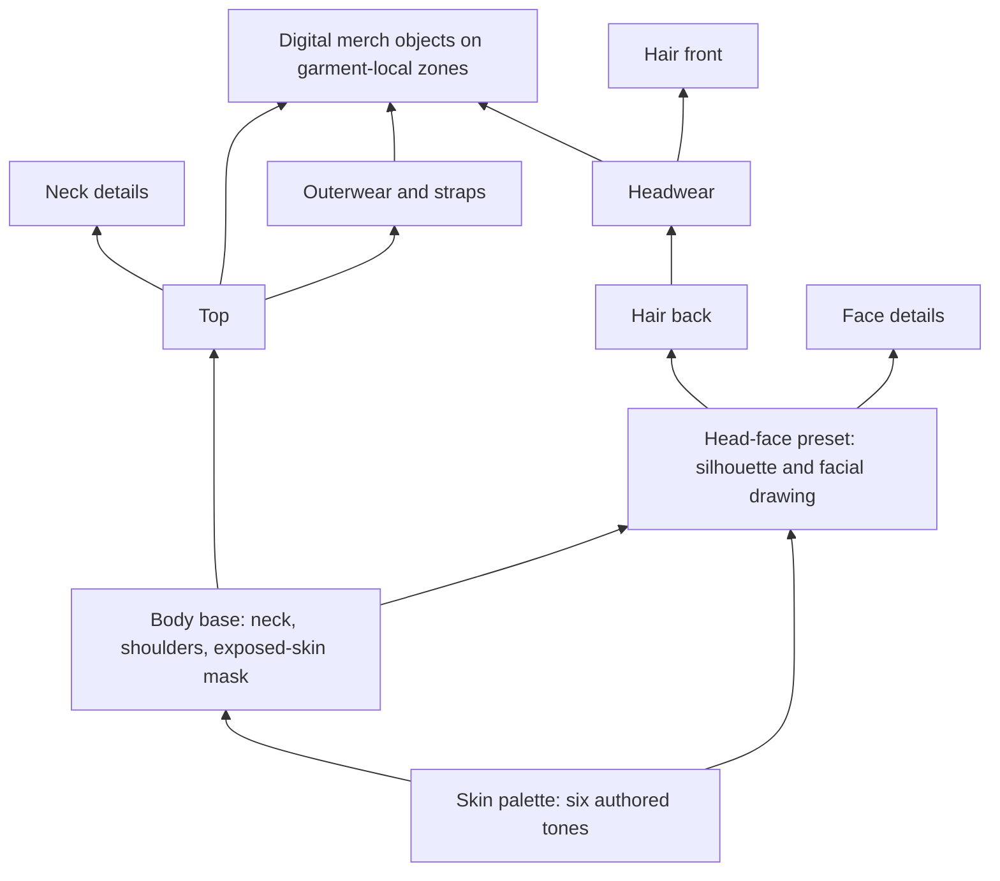

# UPRISE Modular Listener Avatar System R2

Status: design contract for founder review
Date: 2026-07-22
Authority: design proposal connected to current repo truth; not an owner spec

## System Thesis

The listener avatar is a stylized identity and merch fit model. It gives band
shirts, jackets, hats, patches, pins, and buttons a consistent body on which to
appear. The system must let UPRISE replace a head, hairstyle, garment, or merch
object without regenerating the rest of the avatar.

The avatar is not a social-profile substitute, public band-member headshot,
fashion marketplace, collectible by itself, or full-body game character.

## Identity Boundaries

| Image class | Represents | Avatar renderer? | Primary surfaces |
| --- | --- | --- | --- |
| Listener avatar | One listener account | Yes | Home/Plot top shell, Feed listener rail, expanded listener profile |
| Source image | Artist/band/promoter source | No | Source Dashboard, public Artist Profile, source Feed rail |
| Public member headshot | A real source member | No | Public Artist Profile lineup |
| Community/system artwork | Home Scene, RADIYO, Registrar, atmosphere | No | Shell backgrounds, system rails, inserts |

Listener avatars must never become the default public member headshot. The
Source Dashboard may use them only as an internal source-facing fallback where
the current contract permits it.

## Founder Art-Direction Lock

The avatar must be **heavily stylized and facially ambiguous**, not rendered as
a portrait of a particular person. Users should recognize themselves through a
flexible combination of head silhouette, skin tone, hair, clothing, and optional
details rather than through highly specific facial anatomy.

The base face vocabulary must remain deliberately small: simple eye marks, one
nose mark, one mouth mark, optional brow marks, and simplified ears. Avoid
detailed lips, nostrils, cheekbones, eyelashes, wrinkles, realistic facial-hair
texture, modeled anatomy shading, or other likeness-specific cues.

The default visual treatment is monochrome black, off-white, and grayscale with
one restrained fluorescent accent. The accent is reserved for hair, clothing,
or optional accessories and is not used as a skin tone. Community expression is
carried primarily by interchangeable hair, clothing, headwear, and accessories,
not by demographic caricature or community-specific facial types.

The assembled avatar should read as one cohesive illustration, with optional
die-cut sticker presence in supported visual contexts, rather than exposing its
paper-doll construction. Jackets, vests, cardigans, overshirts, and other
outerwear must remain open in the bust system so the undershirt chest area stays
visible and readable for wearable merchandise.

## Two Editing Contexts, One Configuration

- **Listener account/profile:** creates and edits the base identity.
- **Personal Space/Inventory:** later equips owned wearable/digital-merch
  artifacts and places collected flyers or room objects.
- Both read and write one avatar configuration. They are not separate avatar
  systems.

## Composition Model

### Canonical Layer Families

| Z band | Family | Required | Notes |
| --- | --- | --- | --- |
| 100 | Body Base | Yes | Neutral bust silhouette, neck socket, shoulders, exposed-skin mask. Bodies are interchangeable at the neck. |
| 150 | Head-Face Preset | Yes | Head shape and facial drawing authored together. Presets must differ in silhouette/features, not only hair. |
| 200 | Hair Back | No | Bald is a valid selection. Long/back hair sits behind the body/head. |
| 300 | Top | Yes | Tee, tank, long sleeve; owns a readable chest-print zone. |
| 400 | Neck Details | No | Chain, choker, bandana, collar treatment. |
| 500 | Outerwear / Straps | No | Jackets, vests, hoodies-as-outer, overshirts, flannels, suspenders, harness/strap overlays. |
| 600 | Headwear | No | Caps and beanies; declares hair interaction variants/masks. |
| 650 | Hair Front | No | Fringe/strands that cross the face or headwear brim. |
| 700 | Face Details | No | Nose/ear/lip/eyebrow piercings, tattoos, scars/marks, glasses. |
| Host + offset | Digital Merch Object | No | Button, pin, patch, sticker, or similar object attached to an allowed garment/headwear zone. |

## Head And Face Strategy

For the first system, head shape and facial drawing should be one selectable
`Head-Face Preset`. This avoids a repeated identical face with different hair
and prevents badly aligned eyes/noses/mouths across incompatible head shapes.
Hair, skin tone, face details, and body remain independent.

Preset labels should be neutral (`head-01`, `head-02`) rather than gendered.
Representation comes from choice of silhouette, features, hair, body, and
details without forcing a person into a named demographic category.

## Skin Palette Recommendation

Use **six authored skin tones**, selectable independently from head/body shape.

Why not only light and dark:

- two choices create a binary rather than meaningful ambiguity;
- many listeners would be pushed toward a choice that feels unlike them;
- garment and line-art contrast is harder to validate with only extremes;
- adding tones later could visibly change existing identities.

Ambiguity should come from simplified comic line work and non-gendered feature
labels, not from withholding color choices. The exact six values are an art
direction decision, but they should span a useful tonal range, avoid food-based
names, and be stored as neutral IDs (`skin-01` through `skin-06`).

The renderer may apply monochrome/xerox presentation effects in specific UI
contexts, but the saved identity retains its selected skin tone.

## Body Strategy

Start with three neutral bust bodies sharing the same neck socket and crop:

- narrow shoulders;
- standard shoulders;
- broad shoulders.

Do not label them male/female. Tops and outerwear either support all three
bodies or provide explicit compatible variants. A garment is not publishable
unless its compatibility declaration is complete.

## Shared Registration And Local Attachment

The system keeps the earlier R1 two-level anchor model:

1. **Shared body registration:** fixed canvas, neck socket, crown, hairline,
   hat band, brow, chin, shoulder line, chest-print band, and belly crop.
2. **Garment-local attachment zones:** each garment designer marks its own
   lapel, vest panel, suspender, strap, hat band, sleeve, or chest-print zones.

Buttons, pins, patches, and stickers are separate objects. They are never baked
into a garment when they are intended to be owned/equipped artifacts.

## Rendering Contexts

| Context | Crop | Behavior |
| --- | --- | --- |
| Compact Home/Plot shell | `bust` | Avatar remains framed against city-centric atmosphere beside Home Scene title. |
| Expanded Home/Plot shell | `bust-large` | Same avatar moves centrally as the frame opens into music-community atmosphere. The avatar does not change configuration. |
| Feed identity rail | `rail` | Belly-up, non-circular, clothing-readable, normalized to the common source-rail footprint. |
| Listener profile | `bust-large` | Own-account identity preview and base-editor entry. |
| Personal Space | `bust-large` now; full body later | Equipment/display context for owned merch; no separate identity. |
| Source Dashboard member strip | internal crop | Source headshot first, account avatar only as allowed internal fallback. |
| Public Artist Profile lineup | source headshot | Outside this renderer. |
| Discover/shared-listen presence | future | Deferred; must consume the same configuration when activated. |

## Base Creation Flow

The exact route/modal is not locked. The minimum base composer should expose:

1. Head-face preset and skin tone.
2. Body base.
3. Hair style and bounded authored hair color.
4. Starter top.
5. Optional limited face/neck details.
6. Save.

The flow belongs to listener account/profile. It does not require collectibles.
Outerwear collections, wearable inventory, digital-merch attachment, wall
decoration, user-created assets, freeform drag placement, and marketplace
behavior are not part of this base flow.

## Personal Space Equipment Flow

When artifact ownership activates:

1. Open the listener's Merch shelf.
2. Choose an owned wearable or digital-merch object.
3. Show only compatible garments and designer-authored zones.
4. Choose a valid slot/variant; unrestricted drag-anywhere is not the default.
5. Preview at bust and rail size.
6. Save to the same avatar configuration and regenerate flattened renders.

Flyers decorate the Personal Space wall; they do not attach to the avatar.

## Runtime Compatibility Direction

Current consumers expect a flat avatar URL. Future implementation should keep
one saved modular configuration and generate cached flattened renders for named
crops. The bust render can bridge into the existing `User.avatar` field while
surfaces migrate to the richer configuration contract.

Do not composite every avatar live inside Feed rows.

## States And Accessibility

- Never-configured account: initials fallback until the default policy is
  explicitly locked.
- Missing/retired optional part: skip the part and preserve the identity.
- Missing required part: fall back to an approved neutral base.
- Failed image: degrade to the same fallback as absent; do not show a broken
  identity frame.
- Every selectable part needs a text name and selected state.
- Color is never the only distinguishing cue.
- Rail-size QA must verify face, garment silhouette, and chest graphic remain
  readable on light, dark, city-photo, and music-community-photo backgrounds.
- Reduced motion removes bounce/dance effects without hiding identity.

## Explicit Do Not Build From This Contract

- public listener-profile links or DMs from avatars;
- public Artist Profile member avatar fallback;
- marketplace, resale, NFT, wallet, paid cosmetics, or billing;
- user-upload-anything asset pipeline;
- freeform garment or merch positioning;
- avatar effects on Fair Play, Support, ranking, civic authority, or tier;
- one-off body/wardrobe architecture per city or music community;
- full-body requirement before a real full-body surface activates.

## Working Decisions

| Decision | R2 recommendation | Status |
| --- | --- | --- |
| Head and face | Combined authored presets; hair remains separate. | Founder direction, ready to lock |
| Skin tones | Six authored selectable tones, neutral IDs, no slider. | Recommendation awaiting founder approval |
| Bodies | Three neutral bust bodies, interchangeable at one neck socket. | Current founder direction, ready to lock |
| Default avatar | Keep initials until the listener chooses. | Recommendation awaiting founder approval |
| Starter headwear | Permit a tiny plain set only if it does not turn base creation into inventory. | Open |
| Community-specific avatar styles | Core style first; record provenance, add community sets later. | Recommendation awaiting future scope |
| Equip placement | Choose designer-approved zones first; constrained drag may come later. | R1 recommendation, not runtime-authorized |
| Facial specificity | Heavily stylized and ambiguous; minimal reusable face-mark vocabulary. | Founder lock |
| Base art palette | Monochrome black/off-white/grayscale with one restrained fluorescent accent. | Founder lock |
| Outerwear presentation | Open outerwear; preserve an unobstructed undershirt chest plane. | Founder lock |
| Illustration character | Cohesive authored illustration; sticker treatment is permitted and preferred for current exploration. | Founder direction |

## Next Design Slice

Create three visual construction sheets at the same scale. Each sheet must show:

- three body bases sharing one neck socket;
- at least six visibly different head-face presets;
- hair separated from heads;
- the six-tone palette applied to the same preset;
- one tee, one jacket/vest, one suspender overlay, one cap/beanie;
- one piercing/tattoo detail layer;
- one button attached to a valid garment-local zone;
- bust and Feed-rail crops.

Only the illustration style should vary between the three sheets. The system,
part count, crop, and attachment logic must remain constant so the founder can
compare style rather than incompatible architectures.
