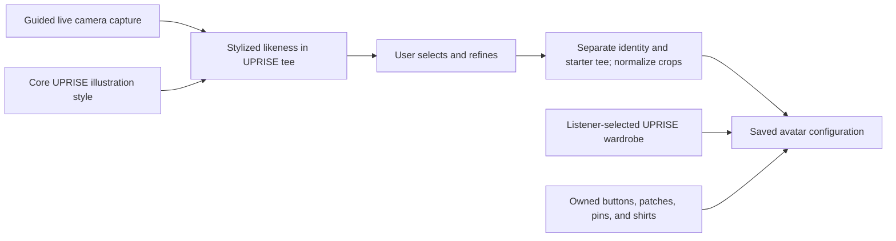

# Photo-Guided Avatar And Promotional Wearables Design Spec

Status: non-authoritative design/prototype evidence; no camera, provider,
persistence, privacy, storage, wardrobe, or wearable runtime is authorized here
Date: 2026-07-26
Surface owner: listener account/profile for base identity; Personal
Space/Inventory for collected wearable equipment
Current visual prototyping tool: Google Flow

## Purpose

Define what it would take for a listener to use a photo as likeness reference
for a highly stylized UPRISE avatar wearing the standard UPRISE tee beneath a
standard open outerwear layer, then
independently choose clothing and equip source-owned buttons, patches, pins,
shirts, and compatible outerwear that visually promote music-community artists
and organizations.

This document does not authorize camera capture, AI candidate generation,
provider submission, or starter-identity persistence. It records a proposed
experience and asset direction only. Runtime work remains blocked until the
relevant owner specs settle consent, retention, moderation, minors, storage,
provider, and server-authoritative selection boundaries. It also does not
activate photo-file upload, public avatar editing, payments, collectible
issuance, source analytics, or promotional click behavior.

## Avatar Maker Boundary

The avatar-maker explanation is complete for this package:

1. the user takes an authorized guided camera photo;
2. the maker creates a highly stylized UPRISE likeness;
3. every candidate wears the standard UPRISE tee beneath the standardized open starter vest;
4. the user selects and saves the identity;
5. clothing and promotional wearables are chosen separately.

Do not expand the generator concept further in this package unless the founder
reopens it. The remaining design focus is wardrobe, attachment zones, custom
wearables, and promotion.

## Evidence And Authority

### Repo-Owned Inputs

- `avatar-system-contract-r2.md`
- `avatar-asset-production-approval-plan.md`
- `asset-production-matrix.md`
- `avatar-design-context-packet.md`
- `docs/founder-sessions/2026-07-11_avatar-modular-merch-taxonomy.md`
- `docs/founder-sessions/2026-07-12_avatar-creation-inventory-boundary.md`
- `docs/founder-sessions/2026-07-26_avatar-outerwear-patch-legibility.md`
- `docs/specs/economy/print-shop-and-promotions.md`
- `docs/specs/users/identity-roles-capabilities.md`

Product behavior remains owned by `docs/specs/**`. This file may propose
interaction and asset directions, but unresolved behavior must be promoted to
an owner spec before implementation.

### Google Capability References

- [Create and edit images in Google Flow](https://support.google.com/flow/answer/16729550?hl=en)
- [Create and use your avatar in Google Flow](https://support.google.com/flow/answer/17102997)
- [Manage Google Flow projects, assets, and characters](https://support.google.com/flow/answer/16935308?hl=en)
- [Google Flow models and supported features](https://support.google.com/flow/answer/16352836?hl=en)
- [Gemini API image generation](https://ai.google.dev/gemini-api/docs/image-generation)

Current Google documentation says Flow can create and edit images, accept
reference images, retain edit history, and create reusable characters. Flow's
personal `@me` avatar is a private Google-account feature and cannot be shared
through public project links or Flow Tools. Treat it as an R&D convenience,
not as an assumed UPRISE integration API.

## Existing Settled Foundation

- The visible listener avatar is an MVP identity surface.
- Listener account/profile owns base avatar creation and core editing.
- Personal Space/Inventory owns later equipping of collected merch and room
  decoration.
- The same saved avatar configuration appears across compact Home/Plot,
  expanded Home/Plot, Feed identity, listener profile, and Personal Space.
- Community identity is `city + state + music community`.
- Hair, headwear, tops, open outerwear, straps, face details, and digital merch
  remain separable asset families.
- Buttons, patches, and pins are digital-merch objects, not baked-in garment
  decoration.
- Every garment declares designer-authored attachment zones.
- Patch name/logo detail is expected to become readable when the avatar is
  enlarged in the center of the expanded top shell. Compact views preserve the
  patch mark without guaranteeing readable text.

## Recommended Product Architecture

Use a hybrid avatar system:

1. AI converts the user-provided likeness reference into a highly stylized
   UPRISE identity wearing the standard UPRISE tee.
2. UPRISE normalizes the selected result to the shared avatar registration,
   crops, palette, and safety rules.
3. The standard tee becomes the saved starter top, not permanent identity art.
4. The listener independently chooses authored UPRISE wardrobe assets.
5. Buttons, patches, pins, and wearable merch attach to declared garment zones.



### Why The Hybrid Model Is Recommended

A flattened AI-generated character can look strong but does not reliably expose
stable jacket panels, suspenders, hat bands, or shirt-print zones. Regenerating
the full person every time a listener equips a patch would introduce drift in
their face, clothing, body, and pose.

The AI output should therefore establish illustrated identity in one consistent
starter tee, while later wardrobe and collectible objects use deterministic
anchors. This preserves likeness while letting the listener change clothes and
community expression without rerolling their face.

### Starter Tee And Outerwear Contract

- Every generator candidate wears the same approved UPRISE tee beneath the
  same unbranded open black denim vest.
- The tee and vest keep the generated comparison focused on likeness while
  establishing the intended layered presentation.
- The UPRISE mark must remain visible in the front-facing `bust-large` crop.
- During normalization, the tee and vest become replaceable starter `top` and
  `outerwear` assets rather than permanent head/face identity art.
- The listener may later replace the shirt graphic and equip compatible
  authored outerwear through Collection.
- The starter tee and vest are not presented as collectible, paid items,
  rarity, or promotional endorsements.

## Generator Experience

### Entry

Base avatar creation remains associated with listener account/profile. Personal
Space remains the later inventory/equipment surface.

The first proposed path is guided camera capture without a local-file
upload/submission alternative. This is not active runtime. Camera use and any
future accessibility or generation-failure fallback require owner-spec
approval.

### Photo-Guided Flow

1. **Consent and explanation**
   - State that the photo is used as likeness reference.
   - State whether the original is stored and for how long. This is unresolved.
   - Do not proceed without affirmative consent.

2. **Camera capture**
   - Request one front-facing, evenly lit photo with the head and upper
     shoulders visible.
   - Allow retake/replacement before generation.
   - Use a browser camera permission prompt and guided frame; do not expose a
     local-file input.
   - Do not require a public profile photo.

3. **Confirm identity details**
   - Let the user identify details the stylization should preserve, such as
     hair silhouette, glasses, facial hair, visible piercings, or a facial
     tattoo.
   - Do not infer gender, ethnicity, politics, personality, or subcommunity
     from the photo.

4. **Apply the core UPRISE art direction**
   - Use one approved UPRISE illustration language for likeness conversion.
   - Preserve the visible hairstyle from the photo unless the user requests a
     bounded correction.
   - Dress every generated candidate in the same standard UPRISE tee beneath
     the same unbranded open starter vest.
   - Do not automatically dress or restyle the person according to a
     music-community stereotype.

5. **Generate a small comparison set**
   - Recommended exploration: three variants using the same photo, pose, crop,
     core UPRISE style, standard UPRISE tee, and standard open starter vest.
   - Vary illustration interpretation and expression rather than changing or
     redressing the person.

6. **Select and refine**
   - Preserve the original candidate in history.
   - Allow bounded requests such as softer expression, stronger ink, keep
     glasses, reduce hair volume, or remove an invented accessory.

7. **Normalize**
   - Convert the selected result to the shared front-facing bust registration.
   - Isolate identity, hair, skin, the starter tee, and starter outerwear as
     required by the renderer.
   - Create `bust`, `bust-large`, and `rail` QA crops.

8. **Choose wardrobe**
   - Begin with the standard UPRISE tee and starter vest.
   - Let the listener replace the shirt graphic or apply authored open
     outerwear after identity normalization.
   - Do not permanently generate collectible patches into the base identity.

9. **Save**
   - Save one avatar configuration consumed by every authorized surface.

### Proposed Persistence Boundary (Not Active)

- The proposal assumes a raw camera capture could be submitted to an approved
  image provider without writing that raw capture to the UPRISE database, but
  neither the provider nor retention boundary is approved.
- The proposed selected configuration includes the generated illustrated
  identity, user-selected music-community context, fixed
  `uprise-tee-black` starter top,
  `outerwear-open-denim-vest-black` starter outerwear, and an initial empty
  wearable configuration.
- Any compatibility use of `User.avatar`, richer avatar-profile record,
  object-storage URL, normalized render, or local development persistence
  remains an implementation proposal requiring owner-spec and schema review.

## Generator Ideas For Review

These are optional design concepts, not settled behavior.

### Identity Lock

After selecting a face/head result, create an identity lock so later changes to
the starter tee, wardrobe, wearables, listening context, or background do not
reroll the person's face.

### Style Intensity

Use a three-position segmented control during exploration:

- `Clean`: simpler ink and restrained scene detail;
- `Raw`: approved default R3 balance;
- `Charged`: stronger spikes, texture, dye, and accent color.

The control changes art intensity, not the user's demographic features.

### Keep These Details

Before generation, offer checkboxes for visible details the user wants
preserved:

- hairstyle silhouette;
- glasses;
- facial hair;
- piercings;
- facial/scalp tattoos;
- neutral or smiling expression.

### Community Wardrobe Collections

Music-community collections may provide optional:

- researched hair and garment suggestions;
- accessory vocabulary;
- shirts, jackets, hats, buttons, patches, and pins;
- bounded accent palettes and print treatments;
- prohibited stereotypes and drift warnings;
- example references from that community's approved art research.

The collection should not prescribe one uniform. Punk, for example, still
needs 1977, street, crust, anarcho, skate, hardcore, Oi/skin, folk, deathrock,
day-glo, and everyday DIY variation.

### Stable Identity Across Communities

Keep one saved illustrated identity. Let the listener independently change
hair, wardrobe, wearables, accent treatment, and atmosphere. Do not generate a
different face when the listener changes listening context.

### Flow-Assisted Beta Production

For a low-engineering experiment:

1. Add the user's authorized photo to a private Flow project.
2. Add the approved core UPRISE character sheet and standard UPRISE tee as
   image references.
3. Generate three consistent front-facing bust variants in the same tee.
4. Refine the selected version using Flow's image edit/history workflow.
5. Export the selected flattened image.
6. Manually normalize and layer it for UPRISE.

This tests demand and art quality but is not a self-service in-product
generator.

### Native UPRISE Generator

For an actual UPRISE feature, investigate the Gemini image-generation API or
another approved image service. Do not assume the Google Flow interface or
private `@me` avatar can be embedded or called by UPRISE.

## Google Flow Prototype Prompt Structure

Use this as a prompt framework, replacing bracketed values with approved
project references:

```text
Use the captured user photo only as likeness reference.
Use the attached approved UPRISE character sheet as the visual-style reference.

Create one front-facing, belly-up illustrated listener avatar with the same
recognizable face shape, hair silhouette, glasses, facial hair, and visible
identity details as the person in the photo.

Render in the UPRISE approved style: bold hand-inked comic lines, simplified
and highly stylized facial construction, flat skin tone, monochrome clothing,
off-white background, and one restrained fluorescent accent.

Keep the face ambiguous and illustrated rather than photorealistic. Do not
change ethnicity, skin tone, age category, or gender presentation. Do not add
piercings, tattoos, logos, slogans, or political symbols that are not visible
in the source photo or explicitly requested.

Use a neutral front-facing pose and the standard UPRISE belly-up crop. Dress
the person in the attached standard UPRISE tee. Do not add other clothing,
collectible patches, buttons, pins, jackets, community costume, or background
scenery.
```

## Wardrobe And Wearable Model

### Saved Layer Families

```text
identity
  head-face
  skin
  hair-back
  hair-front

wardrobe
  top
  neck-detail
  outerwear-or-straps
  headwear
  face-detail

digital-merch
  button
  pin
  patch
  compatible sticker or future approved object
```

Hair color may use alternate color layers within the approved hairstyle source.
Generated identity art must not flatten the selected top, outerwear, or digital
merch into the face/hair layer.

### Garment Attachment Zones

Each wearable owns local anchor geometry rather than relying on unrestricted
screen coordinates.

| Garment host | Example zones | Suitable objects |
| --- | --- | --- |
| Open jacket/vest | primary chest panel, lapel, pocket panel, sleeve | patch, pin, button |
| Suspenders/straps | left strap, right strap | button, pin |
| Hat/beanie | band or fold | button, pin, small patch |
| Top | approved chest-print zone | source shirt art; patch only when authorized |

Patch-compatible outerwear should provide:

- one primary panel for a readable band name or logo in `bust-large`;
- smaller pin/button zones;
- enough open center space to preserve the shirt underneath;
- no permanent studs, seams, or pockets covering every available host zone.

### Digital-Merch Object Requirements

Each custom wearable concept needs:

- object type;
- source/creator identity;
- approved artwork and rights record;
- compatible host-zone types;
- authored scale and rotation bounds;
- light/dark contrast treatment;
- compact and expanded crop previews;
- ownership/equipment state;
- moderation and retirement state.

These are design requirements, not a final API schema.

## Equipping Experience

1. User opens Personal Space/Inventory.
2. User selects an owned shirt, button, pin, or patch.
3. Compatible garments and zones become visible.
4. User selects one approved zone.
5. The avatar previews the equipped object at authored scale.
6. User applies or removes the object.
7. The saved avatar configuration updates across authorized surfaces.

Default to zone selection rather than unrestricted drag-anywhere placement.
Constrained adjustment may be explored later if the owner spec authorizes it.

## Participation Wardrobe Unlock Idea

Status: founder idea; unresolved

Participation may provide a progression path for unlocking additional avatar
wardrobe and customization options.

Recommended category boundary:

- Participation may unlock UPRISE-owned or community-owned hairstyles, colors,
  tops, jackets, hats, accessories, and wardrobe collections.
- Source-owned band shirts, buttons, patches, and pins remain attached to that
  source's authorized collect, purchase, Support-reward, event-artifact, or
  other owner-defined acquisition path.
- Participation does not automatically grant rights to source artwork.

Recommended interaction direction, pending the Participation owner spec:

1. Locked wardrobe items may show the required Participation milestone.
2. Reaching the milestone makes the item available in wardrobe selection.
3. The item remains an avatar option after it is unlocked.
4. Equipping or removing the item does not change the listener's Participation
   score.

The recommendation above treats Participation as a milestone, not spendable
currency. Whether points are consumed, whether unlocks are permanent, and which
categories qualify remain unresolved product decisions.

## How Wearables Promote

The avatar is a visual endorsement surface, not a generic ad slot.

### Compact Surfaces

- Feed rail and compact Home/Plot show the wearable's recognizable mark.
- Patch text is not required to be readable.
- Do not add promotional text around the avatar.

### Expanded Top Shell

- The centered `bust-large` avatar makes the source name/logo readable.
- Shirts, patches, buttons, and pins remain part of the avatar rather than
  separate ad cards.
- This is the primary visual proof that a listener is representing a source.

### Optional Inspection Idea

Pending product approval, selecting a worn object could reveal:

- source identity;
- object name/type;
- what the listener owns;
- one owner-authorized destination.

The destination, action-wheel relationship, analytics, and whether selection
is allowed are unresolved. Do not add a route or CTA until an owner spec locks
the behavior.

### No Automatic Social Behavior

Equipping an item does not automatically:

- publish a Feed post;
- notify followers;
- allocate Support;
- count as a paid impression;
- create an endorsement contract;
- expose private inventory history.

Any such behavior requires an explicit owner-spec decision.

## Key States

### Generator

- no photo selected;
- consent required;
- photo quality insufficient;
- generating;
- generation unavailable;
- safety review failed;
- three candidates ready;
- candidate selected;
- refinement in progress;
- normalization required;
- saved.

### Wearables

- no compatible garment equipped;
- compatible zones available;
- zone occupied;
- object equipped;
- object removed;
- limited permission;
- artwork unavailable or retired;
- moderation hold;
- compact fallback mark;
- expanded readable state.

## Accessibility And Mobile

- Do not rely on color alone to distinguish selected community kit, equipped
  item, or compatible zone.
- Every wearable requires a text name and source label outside the artwork for
  screen-reader use.
- Provide visible focus and non-drag placement controls.
- Offer photo guidance as text and illustration, not camera framing alone.
- Provide text guidance alongside the live camera frame; do not substitute a
  local-file upload control for the required capture in this flow.
- Preserve minimum touch targets when selecting small garment zones.
- Do not require hover to identify a worn patch or button.
- Generated candidates need descriptive labels that distinguish the options
  without appearance ranking such as “best” or “most attractive.”

## Privacy, Safety, And Rights Gates

Before implementation, define:

- whether photo generation is self-only;
- consent and deletion behavior;
- whether originals or embeddings are stored;
- vendor data handling and retention;
- age/minor requirements;
- impersonation and likeness-abuse controls;
- moderation for generated symbols, tattoos, text, and garments;
- handling when AI changes skin tone, age, disability markers, or identity
  features;
- source authorization for logos and band names;
- takedown, retirement, and ownership behavior for digital merch;
- disclosure requirements for AI-generated avatar art.

Google Flow outputs include Google-controlled safety and data policies. Those
policies do not replace an UPRISE consent, privacy, moderation, or deletion
contract.

## Asset Needs

- approved community character-style sheet;
- community-specific research and drift guard;
- neutral front-facing registration template;
- transparent head/face and hair production templates;
- six-tone skin validation sheet;
- starter top and open-outerwear library;
- garment attachment-zone manifests;
- button, pin, horizontal patch, square patch, and logo-patch templates;
- compact, expanded top-shell, Feed rail, profile, and Personal Space QA frame;
- Flow prototype prompt packet;
- manual cleanup/layer-separation checklist;
- rights and generation-provenance record.

## Recommended First Vertical Slice

Prototype one private, staff-assisted Punk avatar:

1. one consenting adult supplies one photo;
2. Flow generates three core UPRISE identity candidates wearing the standard
   UPRISE tee;
3. one candidate is selected and manually normalized;
4. the selected avatar begins in the standard UPRISE tee and equips one
   authored open vest;
5. one separate fictional band patch attaches to the vest's primary panel;
6. render the same configuration in compact Home/Plot, expanded centered top
   shell, Feed rail, listener profile, and Personal Space;
7. verify that identity remains stable, compact crops stay clean, and the patch
   becomes readable only in the expanded state.

This slice tests the risky boundary without building the public generator,
inventory economy, or source authoring tools.

## Do Not Build Or Design Yet

- public or local-file photo upload before consent/privacy decisions;
- automatic inference of music community from appearance;
- automatic community costume or wardrobe assignment;
- automatic gender, race, politics, or personality classification;
- completely different faces for different communities or outfits;
- a Flow `@me` integration assumption;
- flattened AI outfits that cannot accept deterministic merch;
- unrestricted user-uploaded logos or patches;
- freeform drag-anywhere placement;
- automatic Feed publication or Support allocation from equipping;
- fake promotional analytics;
- marketplace, trading, rarity, billing, or paid-placement behavior;
- a spendable Participation currency or wardrobe economy before the
  Participation owner spec authorizes it;
- full-body/back-patch requirements before the front-facing bust system passes.

## Founder/Product Decisions Required

1. Is the first beta experiment staff-assisted in Google Flow, or should the
   first dev spec target a native self-service generator?
2. Is photo-based generation self-only, and what identity/age verification is
   required?
3. Must UPRISE delete the original photo immediately after generation, or can
   the user explicitly save it for later regeneration?
4. Is the photographed hairstyle locked into the identity result, or may the
   listener replace it immediately after generation?
5. Who may create a promotional wearable: verified Artist/Band sources only,
   other source types, UPRISE staff, or listeners?
6. How is a wearable obtained: free collect, purchase, Support reward, event
   artifact, or another owner-defined method?
7. When selected in the expanded top shell, does a worn item open source
   identity, merch detail, an action-wheel destination, or nothing?
8. Does wearing an item create any attributable promotion/support signal, or is
   it visual expression only?
9. What happens when a source retires, replaces, or loses rights to wearable
    artwork already owned by listeners?
10. Are wardrobe items unlocked by Participation milestones or purchased with
    consumable points, and are those unlocks permanent?
11. Which categories may use Participation unlocks, and are source-owned
    promotional wearables excluded unless the source explicitly authorizes
    that acquisition path?

## Dev-Spec Handoff Gate

A development spec should not be written until questions 1-4 establish the
generation/privacy boundary, questions 5-9 establish wearable ownership and
promotion behavior, and questions 10-11 establish Participation progression.
The recommended staff-assisted vertical slice can proceed as a
design/production experiment without activating those runtime contracts.
