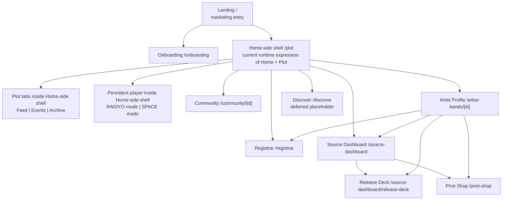

# MVP Screen And Surface Map R1

Status: Active
Owner: product engineering
Last updated: 2026-04-23

## Purpose
Provide one current repo-grounded map of:
- what the screens/surfaces are
- which ones are real routes vs embedded subsurfaces
- the order of features on each screen
- where current runtime is still structurally fragmented

This document is meant to stop:
- screen-inventory guessing
- `Home` vs `Plot` drift
- `SPACE` being described as a full standalone screen when current web runtime still embeds it

## Authority And Reading Rule
Use this order for the map below:
1. `AGENTS.md`
2. `docs/specs/communities/plot-and-scene-plot.md`
3. `docs/solutions/SURFACE_CONTRACT_HOME_R1.md`
4. `docs/solutions/SURFACE_CONTRACT_PLOT_R1.md`
5. `docs/solutions/MVP_ACTION_SYSTEM_MATRIX_R1.md`
6. `docs/solutions/MVP_ARTIST_PROFILE_FOUNDER_LOCK_R1.md`
7. `docs/solutions/MVP_DISCOVER_FOUNDER_LOCK_R1.md`
8. current route/runtime files in `apps/web/src/app/**`
9. dated handoffs

If runtime and surface contracts disagree, do not flatten them together. Call the gap.

## Important Current Gap
Two structural truths must be kept separate:

1. Intended surface structure
- `Home` is the left shell destination
- `Plot` lives inside `Home`

2. Current web runtime route reality
- the Home-side participation shell is still materially expressed through `/plot`
- there is no separate dedicated in-app `Home` route shell yet

Likewise:
- `SPACE` is a real listening/display concept
- but current web runtime still expresses it as an embedded mode inside `/plot`, not as its own standalone route

## Screen / Surface Diagram

## Primary Product Screen Inventory

### 1) Landing / Entry
- Route: `/`
- Status: active
- Kind: public entry screen, not the Home-side shell

Top to bottom:
1. brand badge
2. hero headline + subheadline
3. primary actions
   - `Start onboarding`
   - `Open The Plot`
   - disabled `Discover`
4. three value cards
   - `Scene First`
   - `Fair Play`
   - `No Recommendation Engine`

Notes:
- this is currently the literal first page in runtime
- it is not the same thing as the in-product Home-side shell

Source:
- `apps/web/src/app/page.tsx`

### 2) Onboarding
- Route: `/onboarding`
- Status: active
- Kind: setup flow

Top to bottom:
1. step framing
   - `Scene Details`
   - `Review`
2. Home Scene setup
   - city
   - state
   - music community
3. GPS / location detection
4. review state
   - resolved scene
   - pioneer fallback if needed
5. completion action into Plot/Home-side participation shell

Notes:
- onboarding resolves Home Scene
- Plot/Home-side participation remains blocked until this is done

Source:
- `apps/web/src/app/onboarding/page.tsx`

### 3) Home-Side Shell (Current Runtime Route)
- Route: `/plot`
- Status: active
- Kind: current runtime expression of the Home-side participation shell

This is where the repo currently places:
- the Home-side shell
- `Plot`
- the persistent player
- current embedded `SPACE` mode

#### 3A) Top strip
1. user avatar bust
   - with a text bubble showing the listener's current recommendation
2. `UPRISE <CITY>`
   - beside the listener identity layer
3. top-right controls
   - notification icon
   - settings menu
4. avatar placement
   - the avatar visually rests on top of the player, like it is standing behind it

#### 3B) Persistent player block
1. top-left `Now Playing`
2. below that, the rotation toggle
   - new releases
   - regular / popular rotation
3. in the center
   - artist
   - song
   - timeline
4. in the upper-right area
   - the Uprise identity
   - `city, state, genre`
   - `RaDIYo`
5. mode/state behavior still follows current player ownership
   - `RADIYO`
   - `SPACE`
6. wheel ownership follows player mode
   - `RADIYO` wheel
   - `SPACE` wheel

Sources:
- `apps/web/src/app/plot/page.tsx`
- `apps/web/src/components/plot/RadiyoPlayerPanel.tsx`
- `docs/solutions/MVP_ACTION_SYSTEM_MATRIX_R1.md`

#### 3C) Branch A: Expanded profile / collection panel
The player is the interaction object that gets pulled down to open the user profile / collection workspace.

When the player is pulled down and the profile seam is expanded:
- the profile / collection workspace opens in-place
- the player relocates to the bottom of the expanded workspace
- if screen space allows, the bottom player may retain its normal controls/status
- if screen space is tight, the bottom player may shrink into a minimal strip with a scrolling marquee for band / song title
- the Plot tabs are replaced by the expanded panel

This is not a normal separate profile page navigation. The listener remains inside the Home-side shell, and collapsing the expanded profile restores the prior Plot context.

Top to bottom:
1. profile summary header
   - listener identity
   - activity score
   - status cards
   - calendar card
2. collection tab / section selector directly below the calendar area
   - `Singles/Playlists`
   - `Events`
   - `Photos`
   - `Merch`
   - `Saved Uprises`
   - `Saved Promos/Coupons`
3. active collection section body
   - `Singles/Playlists`
     - saved singles
     - playlist grouping placeholder
     - selecting a single enters `SPACE`
   - `Events`
     - saved event artifacts / flyers
   - `Photos`
     - scene photography
     - current scene
   - `Merch`
     - posters
     - shirts
     - patches
     - buttons
     - special items
   - `Saved Uprises`
     - saved Uprise items
   - `Saved Promos/Coupons`
     - promo/coupon placeholder
4. bottom player strip
   - full player controls/status if there is enough screen real estate
   - compact marquee-only strip if space is tight
   - mode, tier, and rotation-pool information remains player-owned and must not be duplicated as profile metadata
5. return/collapse action
   - `Return to Plot Tabs`

Important interpretation:
- current web runtime expresses much of `SPACE` through this expanded collection/display area plus the `SPACE` player mode
- this is why `SPACE` should not currently be described as a clean standalone route

Source:
- `apps/web/src/app/plot/page.tsx`
- `docs/handoff/2026-04-20_space-mode-personal-player-foundation.md`

#### 3D) Branch B: Plot inside the Home-side shell
When the seam is collapsed, the tabbed `Plot` system is visible.

Tab row:
1. `Feed`
2. `Events`
3. `Archive`

Main content layout:
- left primary column
- right secondary rail

Left column order:
1. active-surface header
   - tab heading
   - tab description
2. active tab body

Current Feed body belongs here:
- explicit S.E.E.D community activity
- artist updates
- listener actions
- community-origin updates
- followed-source updates
- intermittent read-only inserts
  - `Popular Singles`
  - `Buzz`
  - `Upcoming Events`
- feed is the default Plot tab
- feed is deterministic and non-personalized for listeners in the same scene
- no generic `For You` behavior
- no ranking / algorithmic ordering
- no inline `Collect`, `Blast`, or `Follow` on insert cards
- music-card clicks hand the listener into artist-page listening and pause `RADIYO`

Current Events body belongs here:
- scene-scoped event listing

Current Archive body belongs here:
- descriptive archive / stats lane
- current scene metrics and archive-style descriptive reads
- not a legitimacy/ranking surface
- not a tab called `Statistics`

Right rail order:
1. source account switcher, when relevant
2. registrar access card
   - latest status
   - counts
   - `Open Registrar`
   - `Open Print Shop` when allowed
3. selected community card
   - identity
   - member count
   - distance
   - `Open Community`

Bottom:
1. bottom nav / wheel area

Important Plot rule:
- `Plot` is the tabbed system inside the Home-side shell
- it is not a separate sibling screen from `Home`

Sources:
- `docs/specs/communities/plot-and-scene-plot.md`
- `docs/solutions/SURFACE_CONTRACT_HOME_R1.md`
- `docs/solutions/SURFACE_CONTRACT_PLOT_R1.md`
- `apps/web/src/app/plot/page.tsx`
- `apps/web/src/components/plot/SeedFeedPanel.tsx`

### 4) Discover
- Route: `/discover`
- Status: deferred placeholder
- Kind: shell/deferred screen

Top to bottom:
1. Discover label + title
2. `Coming Soon` chip
3. MVP rule copy
   - local-community-only
   - borders open later
4. explanation that discovery currently appears through feed inserts
5. utility actions
   - `Back to Plot`
   - `Home Scene Setup`

Important rule:
- this is not the live discovery engine right now

Source:
- `docs/solutions/MVP_DISCOVER_FOUNDER_LOCK_R1.md`
- `docs/solutions/SURFACE_CONTRACT_DISCOVER_R1.md`
- `apps/web/src/app/discover/page.tsx`

### 5) Artist Profile
- Route: `/artist-bands/[id]`
- Status: active
- Kind: public artist page + direct-listen surface outside `RADIYO`

Top to bottom:
1. artist header
   - artist name
   - entity type
   - slug
   - bio
   - follower/member chips
   - Home Scene identity chip
2. header actions
   - source-side tools when viewer owns the source
   - `Share Artist Page`
   - `Follow`
3. utility/action strip
   - source-tool alignment notice when relevant
   - `Back to Plot`
   - `Visit [Community]`
4. action message area
5. two-column body

Left column order:
1. `Listen Here` section
2. up to 3 song rows
3. each row contains:
   - title
   - metadata
   - `Play/Pause`
   - `Collect`
   - `Recommend` only after real holding
   - timeline / elapsed duration

Right column order:
1. `Artist Info`
2. `Official Links` / `Go Deeper`
3. `Members` / lineup
4. `Events`

Important rules:
- no engagement wheel here
- no `Blast` here
- song collection happens here, not on feed cards

Source:
- `docs/solutions/MVP_ARTIST_PROFILE_FOUNDER_LOCK_R1.md`
- `apps/web/src/app/artist-bands/[id]/page.tsx`

### 6) Community
- Route: `/community/[id]`
- Status: active
- Kind: explicit scene/community page

Top to bottom:
1. community header
   - name
   - identity
   - description
   - state/tier card
2. scene-context badge
3. summary stats
   - members
   - tracks
   - events
4. two-column details row
   - left: community details
   - right: actions
     - `Back to Plot`
     - `Visit Scene in Plot`
5. recent activity section

Important rule:
- this is entered explicitly
- it is not a bottom-nav peer

Source:
- `docs/solutions/SURFACE_CONTRACT_COMMUNITY_R1.md`
- `apps/web/src/app/community/[id]/page.tsx`

### 7) Registrar
- Route: `/registrar`
- Status: active
- Kind: civic/source registration screen

Top-level screen areas from current runtime:
1. Home Scene / eligibility resolution
2. action selection
   - artist/band registration
   - promoter registration
3. source-context awareness when entered from source tools
4. existing entry lists / statuses
5. invite/code verification and redemption work

Important rule:
- Registrar is a real screen
- but its entry belongs in Plot civic workflow and source-side operating flows, not as a bottom-nav peer

Source:
- `apps/web/src/app/registrar/page.tsx`
- `docs/specs/communities/plot-and-scene-plot.md`

### 8) Source Dashboard
- Route: `/source-dashboard`
- Status: active
- Kind: source-side operating shell

Top to bottom:
1. source dashboard header
   - selected source name or empty-state prompt
   - source identity
   - explanatory copy
   - navigation actions
2. source account switcher
3. current-context card
   - Home Scene
   - GPS status
   - promoter capability
4. four tool cards
   - `Release Deck`
   - `Source Profile`
   - `Print Shop`
   - `Registrar`

Source:
- `apps/web/src/app/source-dashboard/page.tsx`

### 9) Release Deck
- Route: `/source-dashboard/release-deck`
- Status: active
- Kind: source-side release management screen

Top to bottom:
1. release-deck header
   - source name
   - source identity
   - explanatory copy
   - chips:
     - music slots: 3
     - paid ad slot defined but inactive
     - Home Scene
   - navigation actions
2. current-context card
3. two-column body
   - left: current music slots
     - slot 1
     - slot 2
     - slot 3
   - right: release form
     - source
     - title
     - album
     - duration
     - audio file URL
     - cover art URL
     - `Release Single`

Source:
- `apps/web/src/app/source-dashboard/release-deck/page.tsx`

### 10) Print Shop
- Route: `/print-shop`
- Status: active
- Kind: source-facing event creation screen

Top to bottom:
1. print-shop header
   - title
   - subtitle
   - chips:
     - Home Scene
     - promoter capability
     - linked artist/bands
   - navigation actions
2. source-context card
3. creator-eligibility card
4. create-event form
   - title
   - cover image URL
   - description
   - start
   - end
   - venue/location name
   - address
   - latitude
   - longitude
   - max attendees
   - `Create Event`

Source:
- `apps/web/src/app/print-shop/page.tsx`

## Screens / Routes Not Treated As Primary Product Screens Here
- `apps/web/src/app/admin/page.tsx`
  - internal/admin
- `apps/web/src/app/users/[id]/page.tsx`
  - not currently the controlling public UX surface

## Design-Critical Truths From This Map
1. `Plot` is not a separate sibling screen from `Home`.
2. Current runtime still uses `/plot` as the Home-side shell route.
3. `SPACE` is currently embedded, not a clean standalone route.
4. Artist Profile is the direct-listen/discovery source page outside `RADIYO`.
5. Discover is currently a deferred placeholder, not the active discovery engine.
6. The current founder-corrected MVP Plot tab set is `Feed`, `Events`, `Archive`.
7. Source-side tools are real current screens:
   - Source Dashboard
   - Release Deck
   - Print Shop
   - Registrar

## Follow-Up Gaps
1. Add a dedicated stable current surface contract for `SPACE`.
2. Reconcile route naming/runtime so the Home-side shell is not mentally conflated with `/plot`.
3. Decide whether the current expanded profile/collection panel should remain the main visible expression of `SPACE` or move toward a cleaner dedicated surface later.
